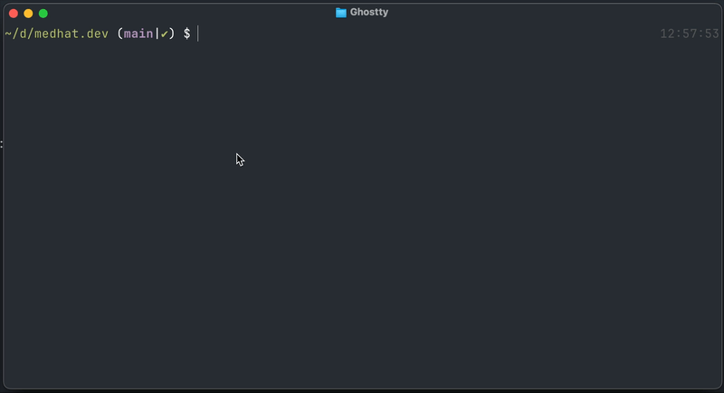

# cconeline

Custom status line for [Claude Code](https://claude.ai/code) CLI.




## What it shows

- Current directory
- Git branch + diff stats (`🌿 main +5 -2`)
- Session tokens + cost (`🔸 12.3K 💰 $0.042`)
- Context window usage bar (`23% ━━━─────────`)
- RTK token savings (`✂️ 1.5M (5.5%)`)
- Session time (`⏱️ 42m`)
- Memory usage (`🔋 8.2/32GB`)
- Model name (`🧠 Sonnet 4.6`)
- Today's tokens + cost (`Today: 🔸 45.2K 💰 $0.156`)
- Monthly cost (`Month: $12.34`)

Each section is individually toggleable via `~/.claude/statusline.conf`.

## Setup

**Via npm (recommended):**

```bash
npm install -g cconeline
cconeline        # interactive setup
cconeline -y     # accept all defaults
```

**Via npx (no install):**

```bash
npx cconeline
npx cconeline -y  # accept all defaults
```

**Via git:**

```bash
git clone git@github.com:medhatdawoud/cconeline.git ~/.claude/cconeline
cd ~/.claude/cconeline
bash bin/cconeline        # interactive setup
bash bin/cconeline -y     # accept all defaults
```

The setup script will:
- Write `statusline.sh` into `~/.claude/`
- Update `~/.claude/settings.json` with the statusLine command
- Interactively configure which sections to show

## Prerequisites

- **jq** - `brew install jq`
- **rtk** (optional, for savings display) - `brew install rtk && rtk init -g --auto-patch`

## Configuration

Sections are controlled by `~/.claude/statusline.conf`:

```bash
STATUSLINE_DIR=1
STATUSLINE_GIT=1
STATUSLINE_SESSION=1
STATUSLINE_CONTEXT=1
STATUSLINE_RTK=1
STATUSLINE_SESSION_TIME=1
STATUSLINE_MEM=1
STATUSLINE_MODEL=1
STATUSLINE_TODAY=1
STATUSLINE_MONTH=1
```

Re-run `cconeline` to reconfigure interactively.
